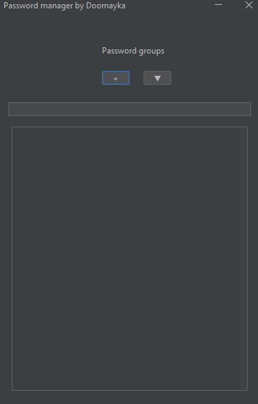
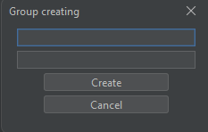
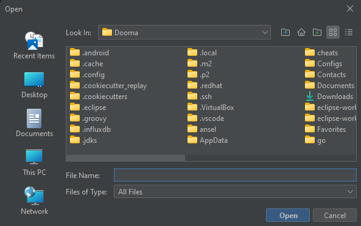
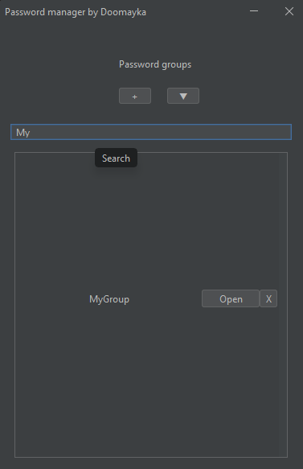
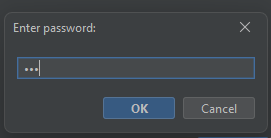
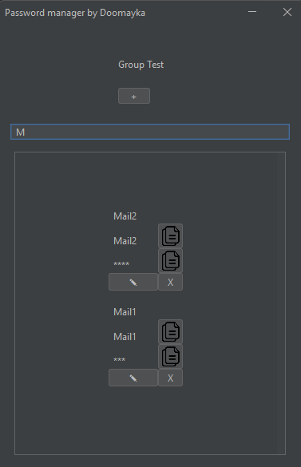
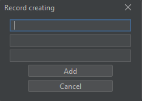

# PasswordManager.GUI

## Возможности

Данное приложение имеет следующие возможности:

- Управление группами паролей.
- Импортирование внешнего файла с группами паролей.
- Управление записями группы паролей.
- Автоматическое сохранение изменений.

## Как запустить?

Последнюю версию приложения можно скачать с GitHub Releases.

Для использования исполняемого файла можно скопировать содержимое папки exe в любую удобную для вас директорию. Для удобства можно создать ярлык приложения. 

Если нет возможности запустить исполняемый файл можно воспользоваться jar файлом.
Для использования приложения его необходимо запустить.

```bash
java -jar app.jar
```

! Путь к приложению не должен содержать пробельные и кириллические символы !

### Зависимости

- JDK 21 и выше
- Gradle 8.0.1 и выше

### Использование

При запуске приложения мы увидим главное окно приложения.



В нём отображается список зашифрованных групп с паролями.
Для создания новой группы с паролями необходимо нажать на кнопку с символом '+' и в появившемся окне ввести необходимую информацию о группе.



Для импортирования уже существующей группы из файловой системы необходимо нажать на кнопку с символом стрелки смотрящей вниз и в появившемся окне выбрать импортируемый файл группы.



На главном окне имеется поле, при помощи которого можно фильтровать группы в списке для более быстрого доступа. Также мы можем удалять необходимые группы нажатием на кнопку с символом X.



Для доступа к группе паролей необходимо нажать на кнопку open и ввести мастер-пароль от группы.



После ввода пароля у нас откроется окно для работы с группой. На нём также есть возможность фильтрации записей. Содержимое записей можно копировать. Для отображения пароля у записи необходимо нажать на скрытый текст. Записи можно изменять и удалять.



Для создания новой записи необходимо нажать на кнопку с символом '+' и в появившемся окне ввести необходимую информацию о записи.



## Документация

Documentation: [link](https://doomaykaka.github.io/PasswordManager.GUI/)